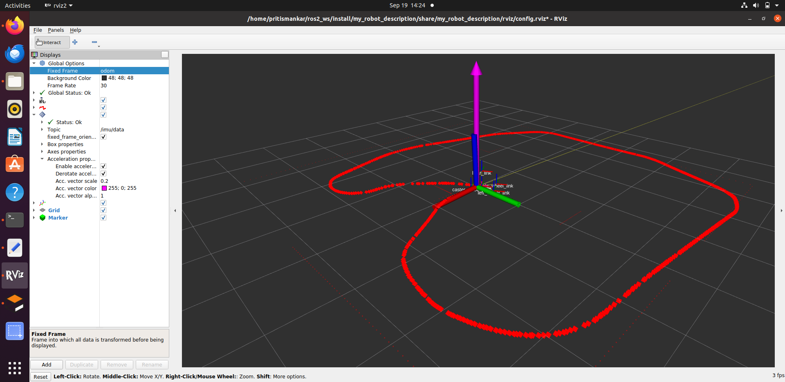

# Differential Drive Robot – ROS 2 Localization 

> Building, simulating, and fusing individual odometry/pose for a differential-drive robot in a simulated Indoor Gazebo Environment, with EKF fusion.

---

## Project Overview
- **Goal:** _Explore odometry from individual sensors, conduct drift analysis from each of them, fuse the pose from different sensors for localizing the robot and conduct different analysis._ 
- **Robot type:** Differential-drive (“diffbot”)
- **Major dimensions:**
  - Wheel radius: _0.05 meters_
  - Wheel separation: _0.3 meters_
  - Base length / width / height: _0.5/0.3/0.1 meters_
- **Kinematics:** Unicycle model → wheel velocity commands.

- **TF Tree with Sensors**


---

## World & Simulation
- World file: [`apartment.world`](src/my_simulation/worlds/apartment.world)  
  _Its an indoor apartment with an cross-section of 7x7 meters with multiple static objects (Sofa, Table, Chair and Box) laying around. This room has a door of 1 meter length and all objects are cuboid shape for simplicity._
- Physics: Gazebo Classic / Ignition
- Controllers: [`diffbot_controllers.yaml`](src/my_simulation/config/diffbot_controllers.yaml)
- **Indoor Apartment with Sensor visualization**


---

## Sensors & Topics
| Sensor / Descritpion | Plugin / Source | Topics | Notes |
|--------|-----------------|--------|-------|
| LiDAR |`libgazebo_ros_ray_sensor.so` | `/scan` | 2-D ranges |
| IMU | `libgazebo_ros_imu_sensor.so` | `/imu/data` | Linear accel + angular vel |
| Wheel encoders | NA | `/dynamic_joint_states` | Integrated velocities |
| Velocity Commands | `libgazebo_ros2_control.so` | `/diff_cont/cmd_vel_unstamped` | Command vel to robot |
| Est Pose from Encoder | NA | `/odom_est` | Processed in my_odometry node |
| Est Pose from IMU | NA | `/odom_imu_est` | Processed in my_odometry node |
| Est Pose from Lidar (WIP) | NA | `/odom_lidar_est` | Processed in my_odometry node |
| Fused Pose from Encoders and IMU | NA | `/odom_fused` | Processed in my_fusion node |

---

## Packages
| Package | Purpose |
|---------|---------|
| **my_robot_description** | URDF, materials, RViz config |
| **my_simulation** | Gazebo world, controllers, launch scripts for static/in-motion Rviz and Gazebo visualization |
| **my_odometry** | Covert individual sensor reading (Encoder, IMU, Lidar) to estimated pose, Send markers for additional visualization in Rviz |
| **my_fusion** | EKF fusion of estimated Encoder + IMU poses, Corresponding marker visualization, Bag file for post analysis, Plot pose from each sensor along with fused pose in a post python script |

---

## Setup & Build
```bash
cd ~/ros2_ws

# delete only if absolute necessary, orelse skip this step
rm -rf build install log [Optional]

# make post analysis script executable
chmod +x src/my_simulation/scripts/velocity_driver.py

# Build workspace
colcon build --symlink-install
source /opt/ros/foxy/setup.bash
source install/setup.bash

# 1. View robot model
ros2 launch my_robot_description display.launch.py

# 2. Start simulation
ros2 launch my_simulation sim.launch.py
# wait for robot to be spawned with controllers getting loaded succesfully

# 3. Run odometry
ros2 launch my_odometry odom.launch.py
# wait for robot to be spawned with controllers getting loaded succesfully

# 4. Start EKF fusion
ros2 launch my_fusion fusion.launch.py
# wait for robot to be spawned with controllers getting loaded succesfully

# 5. To drive the Robot manually in our Environment while Fusion / Odometry node are running. In a 2nd terminal -
cd ~/ros2_ws
source install/setup.bash
ros2 run teleop_twist_keyboard teleop_twist_keyboard --ros-args --remap cmd_vel:=/diff_cont/cmd_vel_unstamped

# 6. [Optional - Example] Running post analysis python script to plot poses from Bag file, After running EKF fusion
python3 src/my_fusion/scripts/plot_odom.py install/my_fusion/share/my_fusion/bags/<path_to_latest_db3_file.db3>
i.e. python3 src/my_fusion/scripts/plot_odom.py install/my_fusion/share/my_fusion/bags/session_20250920_193145/session_20250920_193145_0.db3
 
```

## Launch Files

| File                  | Location                  | Purpose                  | Run Command |
|-----------------------|---------------------------|--------------------------|-------------|
| `display.launch.py`   | `my_robot_description/launch` | View URDF in RViz         | `ros2 launch my_robot_description display.launch.py` |
| `sim.launch.py`       | `my_simulation/launch`    | Spawn robot in `apartment.world` | `ros2 launch my_simulation sim.launch.py` |
| `sim_open_control.launch.py` | `my_simulation/launch` | Same as above + open loop control   | `ros2 launch my_simulation sim_open_control.launch.py` |
| `odom.launch.py`      | `my_odometry/launch`      | Convert Individual sensors to world frame + RViz Marker visualization | `ros2 launch my_odometry odom.launch.py` |
| `fusion.launch.py`    | `my_fusion/launch`        | Start EKF fusion node to fuse Encoders and IMU, Log pose with ROS Bag for post analysis with plots    | `ros2 launch my_fusion fusion.launch.py` |

## Odometry & EKF Fusion

- Odometry from **wheel encoders** → `/odom_est`  
- Odometry from IMU **angular velocity** → `/imu/data`  
- Odometry from LIDAR **Lidar scan (not used for fusion since not tuned yet)**  → `/scan`  
- `visualization_msgs/Marker` is used to plot the estimated pose from wheel encoders in RViz (with Global frame set to 'odom'). `/odom_points`  
- EKF fuses both sources to estimate robot pose → `/odom_fused`  
- `visualization_msgs/Marker` is used to plot the fused trajectory in RViz (with Global frame set to 'odom'). `/fused_points`  
- Through our implementation, we are only trusting IMU sensor pose for yaw calculation in prediction step.  
- The post analysis script depends on ROS Bag file that get's created while running `ros2 launch my_fusion fusion.launch.py`. The files gets stored here `install/my_fusion/share/my_fusion/bags/*` with latest timestamp.
- Currently, the implementation doesn't account for slip. It means the fused pose will keep growing even when the robot gets stuck/blocked. This is planned for future implementation.   
---

## Rviz Configuration for visualizing Estimated Pose

- Add relevant markers (i.e. By Topic->`/odom_points` or By Topic->`/fused_points`) first into Rviz window simulation.  
- Move the Global frame to `odom`  
- As one moves the robot manually using teleops command, these green and red MARKER (respectively) points will start popping up on Rviz window dipicting estimated poses.  
- One can visualize `/odom_points` after running Odometry node and `/fused_points` + `/odom_points` after running fusion node on Rviz. To view them, follow the above steps. To view other odometries (estimated pose from IMU & Lidar, use post-analysis script) The Rviz and Gazebo are already linked in current launch files.  

## Results and Screenshot
- Post Analysis Script: [`plot_odom.py`](src/my_fusion/scripts/plot_odom.py)
- Ground truth depicted in the image is not accurate. Will be removing that out. 

- **Test Case 1:** Drive Robot Manually in ClockWise fashion to complete 1 loop and coming back to starting position.

- Corresponding Post Analysis Plot:


- **Test Case 2:** Drive Robot Manually in Counter-ClockWise fashion to complete 1 loop and coming back to starting position.

- Corresponding Post Analysis Plot:


- **Test Case 3:** Drive Robot Manually with 2 Counter-ClockWise loops + 1 ClockWise loop and coming back to starting position.

- Corresponding Post Analysis Plot:


## Drift Analysis
- The IMU alone shows significant drift, accumulating ~1000 m error after 2-2.5 minute (realtime) of stationary logging (slight movement). The Encoder shows ~0.15 m of drift while the lidar Odometry yeilds a drift of around ~0.6 m in the same scenario.

- **Test Case 3:** Robot remain almost stationary for drift Analysis

- ZoomedIn:

 
- Encoder odometry remains close to ground truth under nominal traction but diverges under wheel slip (when robot get stuck). So for our sensor fusion implementation, we are trusting the Encoder more and using IMU for fusing yaw movements.
- Lidar Odometry has been implemented but needs to be tweaked properly before fusing it in our EKF filter.
- Future work will integrate a slip detector (using IMU acceleration vs encoder velocity) and optionally include LIDAR scan matching to correct drift.  

## Install ROS 2 Foxy on Ubuntu 20.04
```bash

sudo apt update && sudo apt upgrade -y

sudo apt install ros-foxy-desktop \
                 ros-foxy-gazebo-ros-pkgs \
                 ros-foxy-gazebo-ros2-control \
                 ros-foxy-ros2-control \
                 ros-foxy-ros2-controllers \
                 ros-foxy-joint-state-publisher-gui \
                 ros-foxy-teleop-twist-keyboard \
                 ros-foxy-robot-localization \
                 ros-foxy-xacro \
                 ros-foxy-rviz2 \
                 python3-colcon-common-extensions \
                 python3-rosdep \
                 python3-argcomplete \
                 python3-vcstool -y


sudo rosdep init
rosdep update

# Clone my repository or download and place it here:
git clone git@github.com:pritismankar-maan/robotics_urdf_indoor.git
cd ~/ros2_ws

rosdep install --from-paths src --ignore-src -r -y

# Build the project
colcon build --symlink-install
source /opt/ros/foxy/setup.bash
source install/setup.bash

# Install rosbag file 
sudo apt install ros-foxy-rosbag2 ros-foxy-rosbag2-storage-default-plugins

# Verify gazebo and Plugin
ros2 doctor        # Check ROS environment
rviz2 --help       # Test RViz
gazebo --verbose   # Check Gazebo
ls /usr/lib/x86_64-linux-gnu/gazebo-*/plugins | grep imu # verify plugins
# look for - libgazebo_ros_imu_sensor.so
# look for -libgazebo_ros_ray_sensor.so
# look for -libgazebo_ros2_control.so


```
## Future Work (Work in Progress in separate branch)
- Tune lidarOdometry and fuse it with sensors.

### Overview
- Implemented ICP strategy to estimate lidarPose (with translation and Rotation maritx) and tune its parameter
- Scripts to compare Estimated Pose from lidar
- In our current estimation logic, we are considering and comparing point clouds from [2-10] meters to estimate translation and rotation. Max association distance = 0.6 meters and minimum of 30 association per lidar estimate.
- We have been using [`velocity_driver.py`](src/my_simulation/my_simulation/velocity_driver.py) as our unit test file for experiment.
- One can tune EKF from [`velocity_driver.py`](src/my_fusion/config/ekf.yaml)
 
### Setup
```bash
cd ~/ros2_ws

# git branch and git checkout
git branch
git fetch
git checkout feature/lidar-odom-ekf

# verify you are on branch - feature/lidar-odom-ekf
git branch 

# delete only if absolute necessary, orelse skip this step
rm -rf build install log [Optional]

# Build workspace
colcon build --symlink-install
source /opt/ros/foxy/setup.bash
source install/setup.bash

# 1. Run open loop Control, Gazebo along with ROS Bag for post analysis
ros2 launch my_odometry odom_with_lidar.launch.py
# wait for robot to be spawned with controllers getting loaded succesfully

# 2. Post analysis script for comparing lidarPose and EncoderPose
python3 src/my_odometry/scripts/pre_plot_odom.py install/my_odometry/share/my_odometry/bags/<path_to_latest_db3_file.db3>
i.e. python3 src/my_odometry/scripts/pre_plot_odom.py install/my_odometry/share/my_odometry/bags/session_20250921_203442/session_20250921_203442_0.db3

# 1. Run Sensor fusion, open loop Control, Gazebo along with ROS Bag for post analysis
ros2 launch my_fusion fusion_with_lidar.launch.py
# wait for robot to be spawned with controllers getting loaded succesfully

# 5. Post analysis script for comparing lidarPose and EncoderPose
python3 src/my_fusion/scripts/plot_odom.py install/my_fusion/share/my_fusion/bags/<path_to_latest_db3_file.db3>
i.e. python3 src/my_fusion/scripts/plot_odom.py install/my_fusion/share/my_fusion/bags/session_20250921_201222/session_20250921_201222_0.db3 

```

### Experiments
- **Test Case 4 (with Open loop con):Pose comparison of lidarOdom vs encoderOdom**
 

- **Plot estimated posed from each sensor along with EKF Fused Pose**
 

- **ZoomedIn on the same plot**
 


